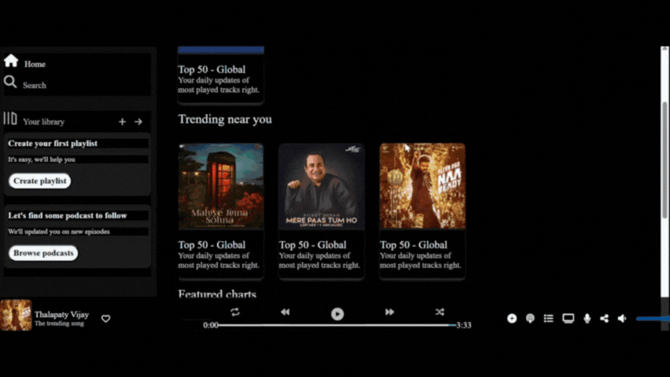

# 🎵 Spotify Clone (HTML + CSS)

A static clone of the Spotify web player built using only **HTML** and **CSS**. This project mimics the layout, design, and interactivity (visually) of Spotify without using any JavaScript or backend logic.

---

## ✨ Features

- 🎶 Sidebar navigation with Spotify icons
- 📂 Playlists section with scrollable list
- 🎵 Song thumbnails and titles
- 📻 Player bar at the bottom (play/pause UI only)
- 🎨 Fully responsive design
- 💻 Pure HTML & CSS — no JS, no frameworks

---

## 📁 Folder Structure
>Music Folder
   >Assests #images of the songs, icons and preview etc.
   >CSS file #styles 
   >HTML File #Structure